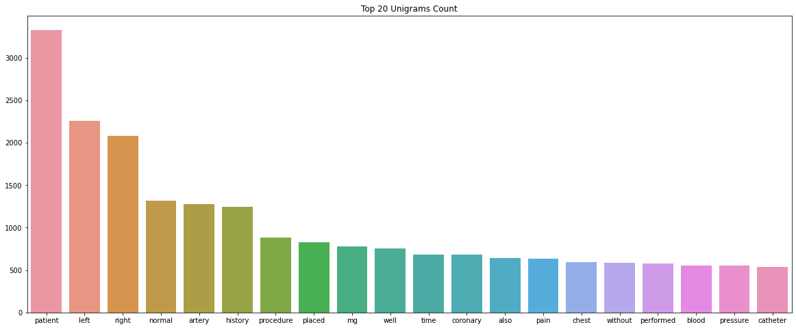

# NLP-Clinical-Notes-Challenge
The goal of this task is to propose different approaches to generate vector representations of texts (tokens)  and assess and compare the suitability of the approach for this dataset.

## Experiments:
1) Exploratory Data Analysis: Exploratory data analysis for this challenge is exists in NLP_Challenge_EDA.ipynb file

2) PubMed Word2vec: Word vectors were induced from PubMed and PMC texts and their combination using the word2vec tool. 
                    The word vectors are provided in the word2vec binary format. Model evaluation and code exists in 
                    PubMed_Word2Vec_Embedding.ipynb file

3) Bert Large Model: BERT is a transformers model pretrained on a large corpus of English data in a self-supervised fashion.
                     Model evaluation and code exists in Bert_Word_Embedding.ipynb file.

4) Bio Bert model: BioBERT (Bidirectional Encoder Representations from Transformers for Biomedical Text Mining), which is
                   a domain-specific language representation model pre-trained on large-scale biomedical corpora. 
                   Model evaluation and code exists in BioBert_Word_Embedding.ipynb file.

5) Bio Clinical Bert model: The Bio_ClinicalBERT model was trained on all notes from MIMIC III, a database containing 
                           electronic health records from ICU patients at the Beth Israel Hospital in Boston, MA. For
                           more details on MIMIC, see here. All notes from the NOTEEVENTS table were included (~880M words).
                           Model evaluation and code exists in BioClinicalBert_Word_Embedding.ipynb file.

6) PubMed Bert model: PubMedBERT is pretrained from scratch using abstracts from PubMed and full-text articles from 
                      PubMedCentral. This model achieves state-of-the-art performance on many biomedical NLP tasks, 
                      and currently holds the top score on the Biomedical Language Understanding and Reasoning Benchmark.
                      Model evaluation and code exists in PubMedBert_Word_Embedding.ipynb file.
## EDA:

## Results:

### 1) Cosine distance is calculated for asseing the similarity between word vectors 

| No. | Term1 | Term2 | PubMed Word2vec | Bert Large | Bio Bert | Bio Clinical Bert | PubMed Bert |
| :---: | :---: | :---: | :---: | :---: | :---: | :---: | :---: |
| 1     | Glaucoma | Fibrillation | 0.384217 | 0.894104 | 0.872067 | 0.941967 | **0.950928** |         
| 2     | Carbatrol | Dilantin | 0.547312 | 0.921481 | 0.877101 | 0.926522 | **0.954106** |
| 3     | Cardiomyopathy | Tylenol | -0.002026 | 0.879889 | 0.778894 | 0.901180 | **0.926579** |
| 4     | Herpes | Hyperthyroidism | 0.227363 | 0.883667 | 0.872658 | 0.909672 | **0.956872** |
| 5     | Seasickness | Nausea | 0.240243 | 0.844041 | 0.858088 | 0.827762 | **0.944510** |

### 2) Performance of model on clinical notes dataset

| No. | Model | Algorithm | Test Accuracy |
| :---: | :---: | :---: | :---: | 
| 1     | PubMed Word2Vec | Linear SVC  | **94.51%** |          
| 2     | Bert Large | Linear SVC | 72.56% | 
| 3     | Bio Bert | LLinear SVC | 89.02% | 
| 4     | Bio Clinical Bert | Linear SVC | 90.24% |
| 5     | PubMed Bert | Linear SVC| 93.29 | 

## Refrences:

1) A Survey of word embeddings for clinical text.

   https://www.sciencedirect.com/science/article/pii/S2590177X19300563

2) Building a medical search engine.
 
   https://medium.com/posos-tech/building-a-medical-search-engine-step-1-medical-word-embeddings-ec9b13e1870d

3) Bert Embedding Tutorial.

   https://mccormickml.com/2019/05/14/BERT-word-embeddings-tutorial/

4) https://www.nature.com/articles/s41597-019-0055-0.pdf
